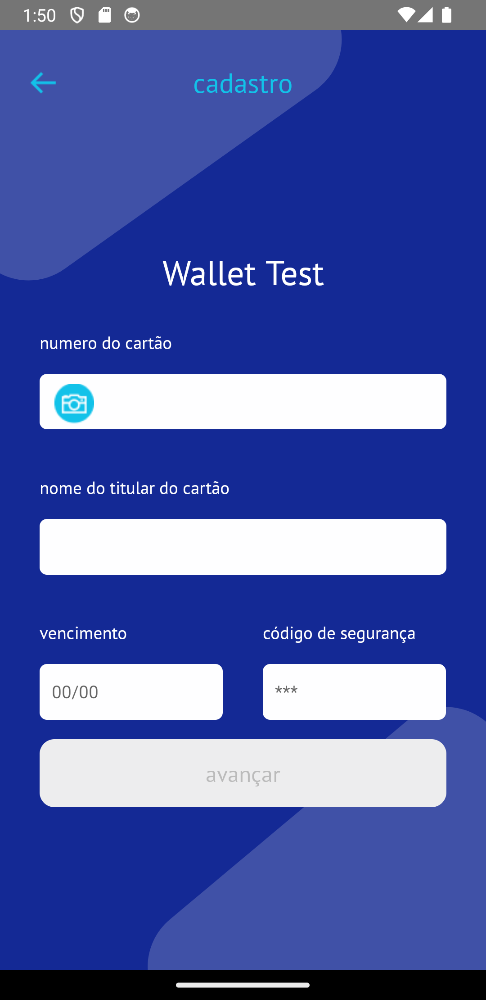
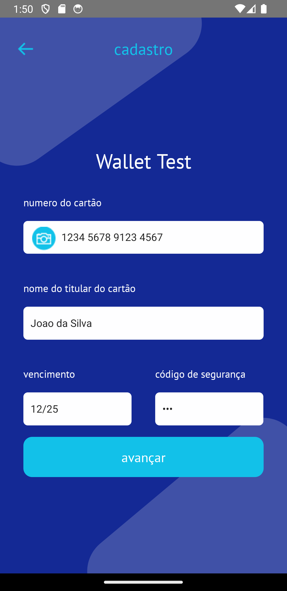
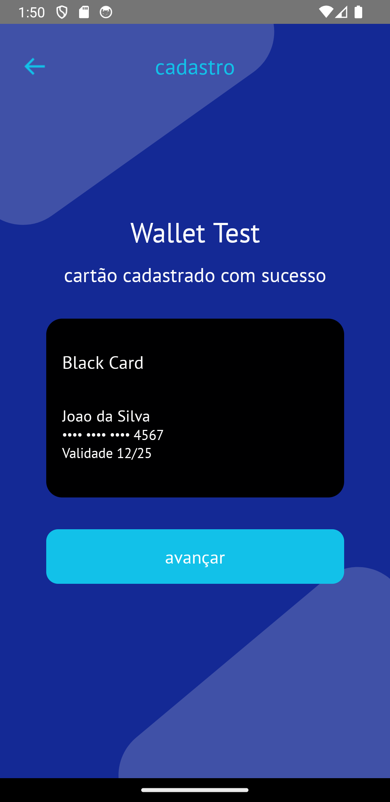
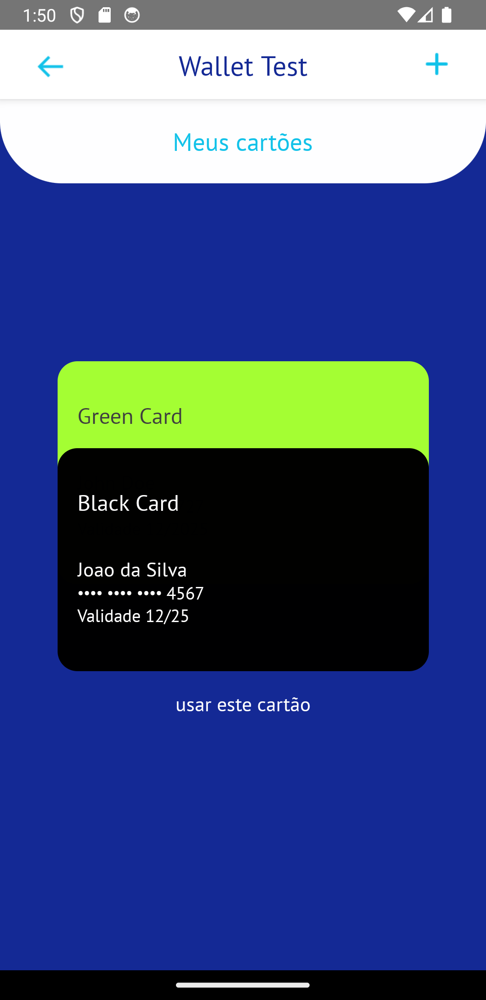
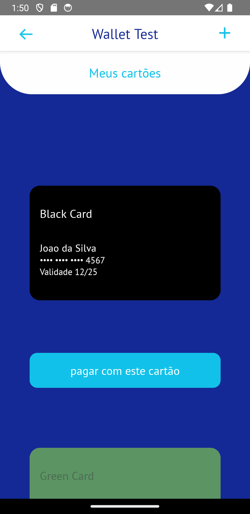
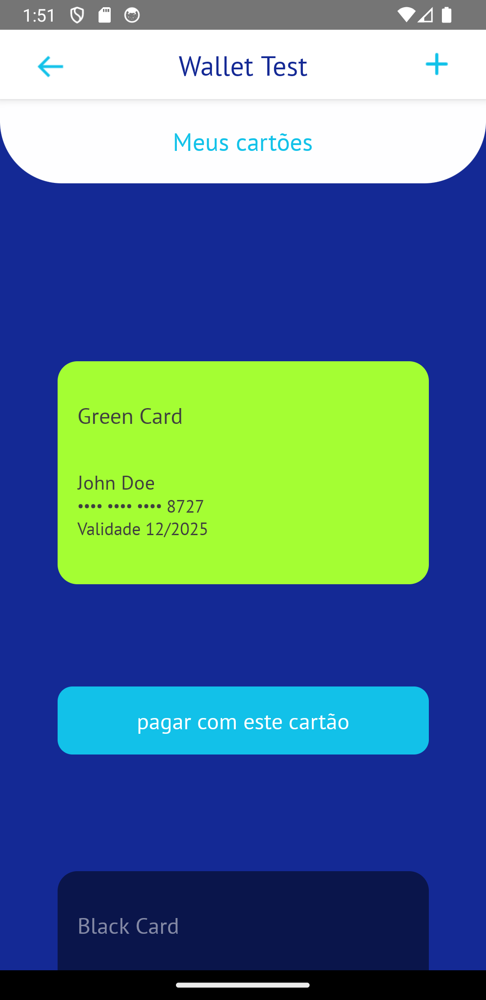

# Card Wallet

Observação: o projeto foi testado apenas no Android.

## Instruções para rodar o projeto

As instruções abaixo são para rodar o projeto no **emulador do Android**.

* A variável de ambiente JAVA_HOME deve estar apontando para um JDK maior ou igual a 17.
* Clone este repositório e rode o comando `npm i`
* Abra outro terminal dentro do repositório e inicie o json-server através do comando `npx json-server db.json`
* Anote a porta por onde o json-server está rodando, abra o arquivo `.env` no root do projeto e adicione a porta correspondente na URL da variável `JSON_SERVER_URL`. Observação: para que o json-server funcione no emulador do Android é necessário que a URL de requisição seja http://10.0.2.2:PORTA
* Rode o comando `npm run android` para inciar o projeto.

## Imagens

